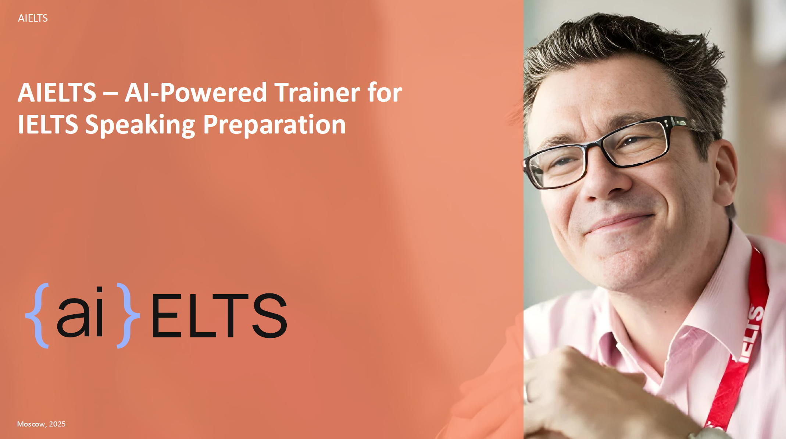
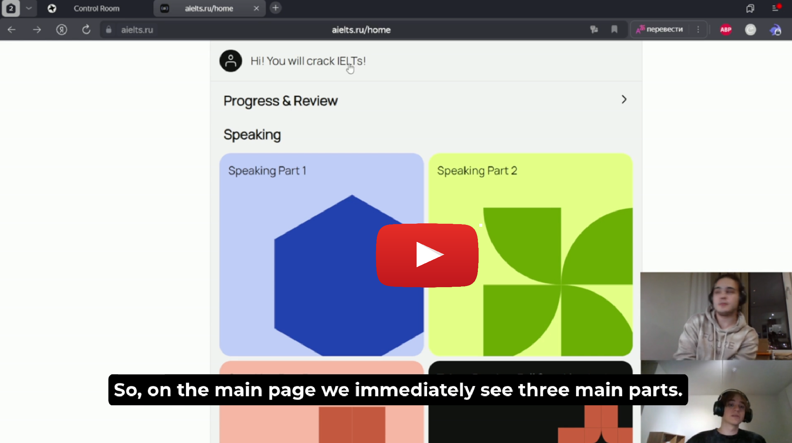

# AIelts

This application provides effective preparation for the IELTS Speaking test by delivering detailed practice combined with personalized feedback.
Users engage by recording their responses to a wide array of exam questions, covering all three parts of the IELTS speaking module. This process simulates actual exam conditions, allowing for systematic skill development. 
After you record, your speech is automatically turned into text by the most advanced and new speech-to-text models. They track all your pauses, pronouncation mistakes and tone so no information is lost! It is then carefully reviewed by our AI system. To make sure the feedback is as accurate and helpful as possible, our AI uses a RAG (Retrieval-Augmented Generation), which connects it to our exclusive collection of actual IELTS speaking tests records. Deliberate tuning of our AI system makes it perform with astonishing 94% accuracy[^1] in grading. 

In addition to grading your speaking with an actual IELTS criteria, AIelts is designed to give you really useful and practical feedback to improve every part of your spoken English. It will pinpoint any grammar mistakes, awkward sentences, or wrong words you used, helping you fix basic language issues. Also it tracks your speech speed and suggests suitable phrases. This is just a small part of what our personal feeback covers, our model addresses all critical aspects of the IELTS speaking exam and helps you boost your speaking abilities drastically. 

On top of that, it is an extremely convenient, easy and pleasent to use application which makes the preparation less painfull.

[^1]:A prediction is considered correct if it differs from the expert's score by no more than 1 point. 3 criteria are predicted: Fluency and Coherence, Lexical Resource, Grammatical Range and Accuracy. Evaluated on 11 transcripts from the test sample, 31 out of 33 criteria overall predicted correctly.

## Presentation 
We presented this application as a commercial product on several events.
**Click on the image below to view the full PDF presentation.**

## AIelts Demo Video 
We also have a Demo video of our application that shows how the platform looks like and how the AI-module works there. 
It is originally recorded in Russian, English subtitles are added. 

**Click on the preview to watch the video on Google Drive**